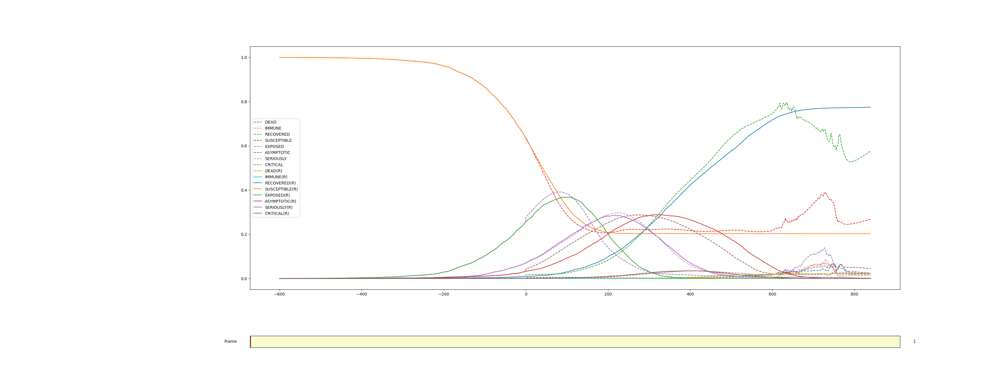

# model - The ML part

## Requirements

You will need numpy, pytorch and tensorboard.

## Training

You can train the net by calling `python3 train.py -s 1.0  -b <batch_size> --epochs <epochs>` Good values for batch size and epochs are 128 and 30 respectivly. This script expects data to be present in `../INFEKTA-HD/data/runs16`.

You can get training data by either running the tools in [INFEKTA-HD](../INFEKTA-HD) or by downloading them [here](https://heibox.uni-heidelberg.de/f/96df4acf2e4247b4be84/).

## Prediction

You can run prediction by executing:

```
python3 predict_timeseries.py --model <path to model>  -i <path to sample data> -s 1.0
```

You can change the start time of the simulation by adapting the `START_TIME` in `predict_timeseries.py`.

The result looks like this, dashed lines are our ML model: 

